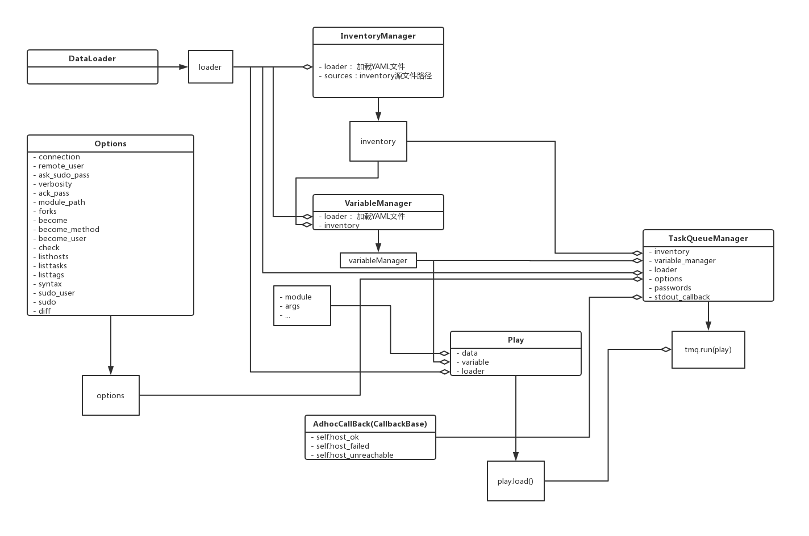

# Ansible-API
> 基于ansible 模块的二次开发

> Ansible 2.4.1  
> Python 2.7

### AdHoc类
- 传入 hosts, module, args等相关参数
- 执行任务
- 返回自定制的dict，便于序列化成JSON数据
- 在符合RESTful协议的前后端分离的系统中，调用AdHoc类，即可容易定制请求JSON数据与响应的JSON数据
- 类调用图

### PlayBook类
- 正在开发中。。。