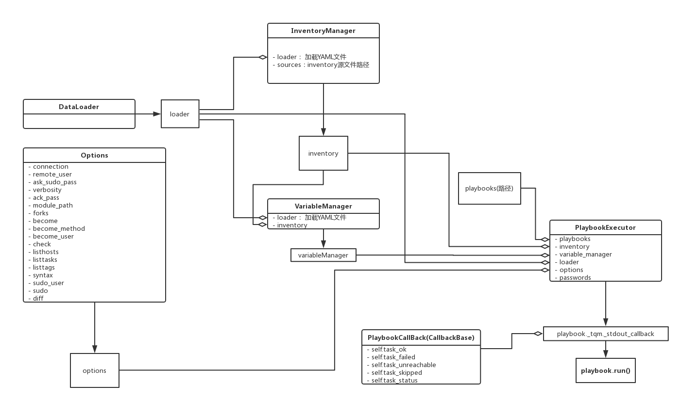

# Ansible-API
> 基于ansible 模块的二次开发

> Ansible 2.4.1  
> Python 2.7

### AdHoc类
- init：传入 hosts, module, args等相关参数
- run方法： 可以传入fork, gather_facts, inventory路径 等 参数，有默认值，可以不传 参数，有默认值，可以不传
- get_result方法：返回自定制的dict，便于序列化成JSON数据
- 在符合RESTful协议的前后端分离的系统中，调用AdHoc类，即可容易定制请求JSON数据与响应的JSON数据
- 类调用图

### PlayBook类
- init: 传入 hosts, playbook_path等相关参数
- run方法：可以传入fork, inventory路径 等 参数，有默认值，可以不传
- get_result方法：返回自定制的dict，便于序列化成JSON数据
- 在符合RESTful协议的前后端分离的系统中，调用Playbook类，即可容易定制请求JSON数据与响应的JSON数据
- - 类调用图
